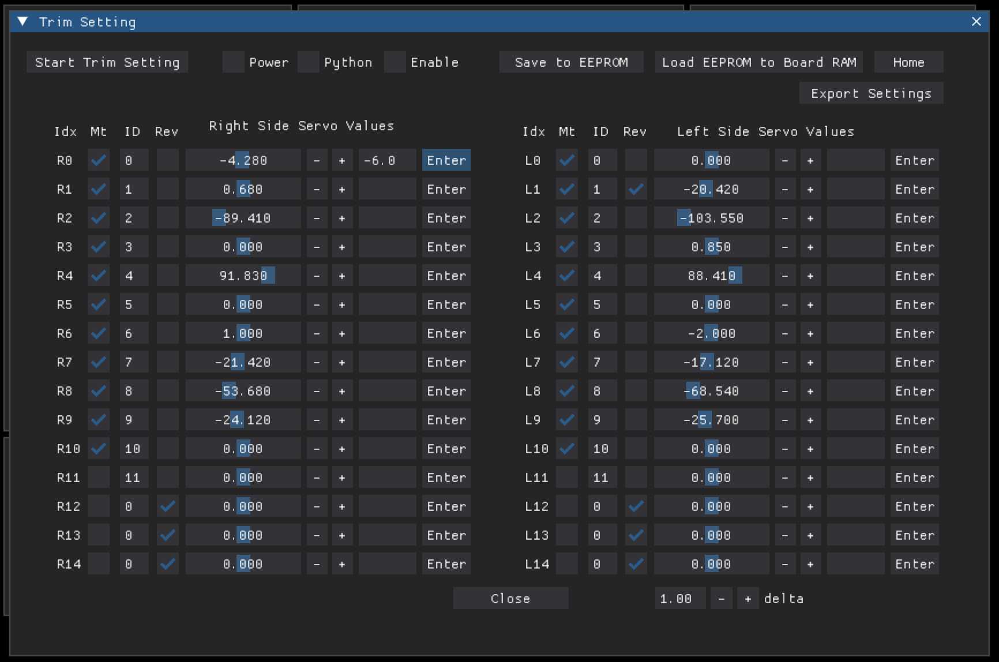

# [Meridian_console](https://github.com/Ninagawa123/Meridian_console) 
Meridian consoleは, ロボットのリアルタイムなデジタルツイン化を実現するmeridian flow systemの一部です.  
ESP32等のwifi付きマイコンボードとペアで使用することで, ロボットの状態情報をデバイス間で100Hzの頻度で共有することができます.  

  
<p align="center"></p>  
  
Meridian_console.pyをPCで実行することで, PC側で受け取った情報を表示したり, コマンドを送信したりすることができます.  
現在, ROS1の入出力およびredisの読み取りに対応しています.  
ROSを持たないWinやMacにも対応しており, 手軽にMeridianの通信をテストすることができます.  
Win, Mac, Ubuntuで動作します.  
  
## 動作確認に必要なもの  
- pythonが動くPC  
- Meridianが書き込まれたマイコンボード(ESP32_DevkitC等)  
- Meridian専用Board (必要に応じて)  
  
## 準備  

```  
$ pip install numpy  
$ pip install dearpygui  
$ pip install redis  
```  

など, 必要なライブラリをインストールしてください.  
  
## 実行方法  
  
```  
$ CD ~/(Meridian_console.pyのあるディレクトリ)  
$ python Meridian_console.py [送信先のESP32のIPアドレス 例:192.168.1.17]  
```  
  
※送信先のIPアドレスを記入しない場合, board_ip.txtで設定された値で接続を試みます.    
※IPアドレス情報が見つからない場合は, ターミナルで入力を促されます. 内容はboard_ip.txtに保存されます.  
  
Windowsの場合, Meridian_console.pyの起動時に通信を許可するかどうかのダイアログボックスが出ることがあります. 許可とすることで実行が可能ですが, 実行できない場合は下記の設定を行なってください.  

<details close>
<summary>WindowsでFirewallの設定が必要な場合</summary>
<br><pre>
  1. Windowsの検索バーに「ファイアウォールとネットワーク保護」と入力し, ファイアウォールの設定を開きます.  
  2. 下側にあるメニューから「詳細設定」をクリックします.  
　　「このアプリがデバイスに変更を加えることを許可しますか？」→「はい」  
  3. 「受信の規則」  
     -「受信の規則」をクリックし, 右側の「新しい規則」をクリックします.  
     - 「ポート」を選択し,「次へ」をクリックします.  
     - 「UDP」を選択し,「特定のローカルポート」に「22222」を入力し,「次へ」をクリックします.  
     - 「接続の許可する」を選択し,「次へ」をクリックします.  
     - 「ドメイン」「プライベート」「パブリック」の全てにチェックを入れ,「次へ」をクリックします.  
     - 「名前」に「Meridian_22222」を入力し,「完了」をクリックします.  
  4. 「送信の規則」  
     - 「送信の規則」をクリックし, 右側の「新しい規則」をクリックします.  
     - 「ポート」を選択し, 「次へ」をクリックします.  
     - 「UDP」を選択し, 「特定のローカルポート」に「22224」を入力し,「次へ」をクリックします.  
     - 「接続を許可する」を選択し, 「次へ」をクリックします.  
     - 「ドメイン」「プライベート」「パブリック」の全てにチェックを入れ,「次へ」をクリックします.  
     - 「名前」に「Meridian_22224」を入力し, 「完了」をクリックします.  
</pre>
</details>


上記を実行し, 画面が表示されれば成功です.  
別途用意したMeridianボードを起動すると, 数秒で接続が確立し, 画面の数字がチラチラと動き始めます.  
標準設定の通信速度はTeensy4.0もしくはESP32側で決定され, デフォルトでは100Hz, 1秒間に100回の往復通信を行います.  
  
起動時はロボットのサーボは脱力しており, サーボの軸角度を手で動かすとスライダーに反映されます.  
  
## 終了方法  
ターミナルでctrl + c を押して終了します.  
  
## 画面の解説  
  
  
  
#### Axis Monitor  
受信したサーボの角度を表示します.  
Powerオンの時, スライダーでサーボを動かすことができます. (CommandウィンドウのPower,Python,Enebleの３箇所にチェックを入れて下さい)   
Home   : すべてのサーボポジションに対し一度0を代入します.  
Trim   : トリム調整モードのウィンドウを開きます. (詳細後述)  
Target : ボードへの送信データを表示します.  
Actual : ボードからの受信データを表示します（サーボの動作結果位置など）  
  
#### Sensor Monitor  
6軸センサーや9軸センサーの値を表示します.  
SetYaw : ヨー軸の中央値をリセットします.  
  
#### Command  
POWER  : 全サーボのパワーをオンオフします.  
DEMO   : サインカーブの全身モーションを計算します.  
Python : ユーザー定義のpythonコードを反映します.  
Enable : Demoやpythonを送信に反映します.  
->ROS1 : ROS1のjointデータをパブリッシュします.（Rvisと連動できます）  
<-ROS1 : ROS1のサブスクライブします.(動作未確認)  
<-Redis: Redisのデータを読み取ります.(sim2real等で使用)  
Control Pad Monitor: ESP32やTeensyに接続されたリモコンの値を標準化して表示します.  
  
デモの実行例  
「DEMO」「Power」「Enable」のチェックをオンにすることで,  
ロボットのサーボにパワーが入り, サインカーブで構成されたダンスのデモを行います.  
  
#### Button Input  
リモコンのボタン入力値をPC起点で出力します.  
  
#### Mini Terminal  
Meridim配列に差し込みたいデータ値を8つまで同時送信することができます.  
MeridianのIndex（Meridim90であれば0~89）とdataをテキストボックスに入力後, Setボタンを押し,　さらにSendにチェックを入れることでデータが送信されます.  
※ Setを行うことでバッファにデータがセットされ, Sendのチェックを入れることでそのデータが送信されつづけます.  
※ Indexの範囲外のデータは無効となり送信されません. また, チェックを外した時に送信バッファの各Indexに-1が代入されます.  
Flow/Step  : フローモードとステップモードを切り替えます.  
Next frame : ステップモード時に1フレームだけ次に進みます.  
  
#### Message  
IPと各経路のエラーカウント, エラー率, フレーム数, 動作周波数を表示します.  
ResetCounter: カウンタの値をリセットするボタンです.  
TsySKIP, PcSKIP: 連番データの取りこぼし数を表示します.  
※ ESP32にPS4リモコンを接続した際に受信スキップ回数が5%ほど検出されるのは,現在の仕様では正常な動作です.  
※ I2C接続のMerimoteを使用した場合, PS4リモコン接続での受信スキップ回数はほぼ0になります. 

#### Trim Setting Window  (2025.05.04現在, LITE版のみ対応)
[Axis Monitor]の [Trim]ボタンにより開きます. 実機を見ながらサーボのトリム値を調整し, EEPROMに保存することができます.  
受信したサーボの角度を表示します.  

<details>
<summary>トリム調整の方法</summary>

  
  
以下の手順でサーボのトリム値を設定します.  
サーボ設定はEEPROMに保存されます.  
  
1.Power, Python, Enable の3箇所すべてにチェックを入れます.  
  
2.[Start Trim Setting] ボタンを押します.  
   Board側のトリム値が0リセットされ, ウィンドウのスライダーにトリム値が反映されます.  
  
3.実機を見ながら, トリム値を入力します.  
  スライダーもしくはインプットフィールドへの入力+Enter,もしくは-+ボタンでトリム値を調整します.  
  
4.調整できたら,[Save to EEPROM]ボタンを押します. Board側にデータが送信され,EEPROMに登録されます.  
  
5.[Load EEPROM to Board RAM]ボタンを押します. EEPROMからBoardにトリム値などが反映します.  
  この時, ロボット実機がトリムポーズではない位置に動く場合があります.  
  
6.[Home]ボタンを押すと, サーボは新しいトリム値を基準とした0位置に移動します.(トリムポーズ)  
  
7.[Export Settings]ボタンを押すと, 最後にEEPROMに読み書きしたトリムデータがテキスト形式で出力されます.  
  出力ディレクトリはこのpythonコードと同じ場所になります. ファイル内容はMeridianのBoard用コードにコピペできる形式です.  
  
8.設定が完了したら[close]ボタンを押して閉じます.  
  
9.実機の起動時に設定値が有効となるようにするには, Board用コードのconfig.hの設定を下記のようにします.  
  #define EEPROM_SET     0  
  #define EEPROM_LOAD    1  
  
以上により, 実機の起動時にEEPROMの設定値が読み込まれるようになります.  

</details>
  
#### 最近の修正
2025.xx.xx リセットボタンやリモコンアナログ入力値表示など細かな修正をしました.  
2025.04.06 ESP32のwifiIPをboard_ip.txtに格納するようにし, 未設定時はターミナルで入力するようにしました.  
2025.04.06 Redisの読み取り機能を追加しました.  
2025.05.04 トリム調整モードを追加しました.  
